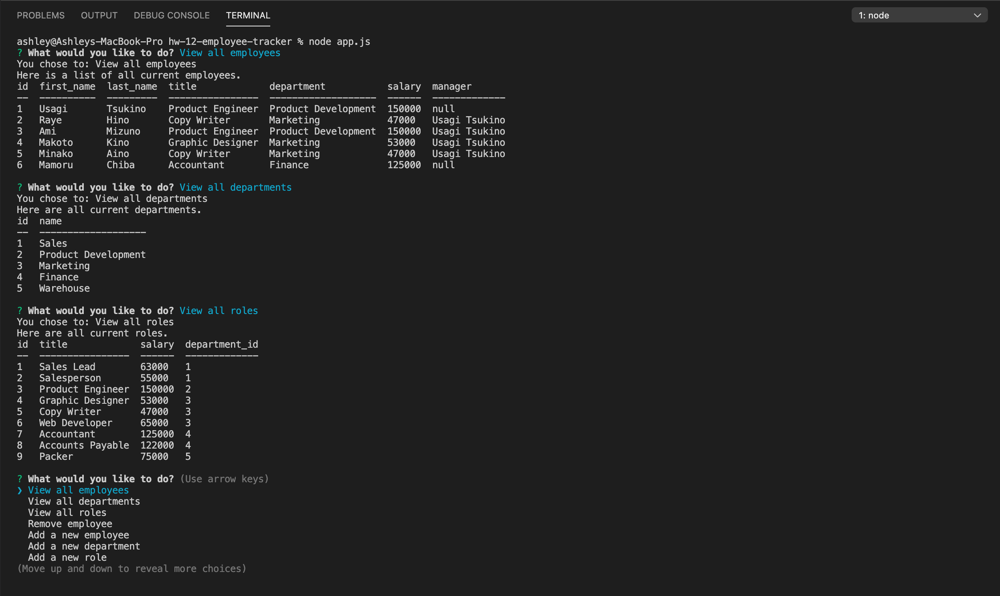

# hw-12-employee-tracker

The challenge was to create a terminal application that would help manage company employees using node, inquirer, and MySQL. Using this style is similar to how a CMS would work, in tht non-developers would be able to dynamically change content within a database.

<br>

## Overview

A dynamic input was created to show employee information: 



<br>

## Goals Achieved
  
* Build a command-line application that at a minimum allows the user to:

  * Add departments, roles, employees

  * View departments, roles, employees

  * Remove employees

<br>

## User Story

```
As a business owner
I want to be able to view and manage the departments, roles, and employees in my company
So that I can organize and plan my business
```
<br>

## Initial Installation
Copy the repo with completed code and information. Once on your local machine use the following command in your terminal:

```
npm install 
```
- with no paramerters will just be sure you pull down dependancies listed in the json file
- only run if there are existing dependancies in the json file

All dependanies are listed within the package.json file so they will install automatically. If you run into any missed dependancies or want to add some of your own custom code use the following command: 
```
npm install (package name)
```
- run for other dependancies
- Just add in each package with the name of the package

<br>

## Packages Required

* MySQL
* InquirerJS
* console.table

Use this list as reference incase npm install misses any required packages

<br>

## What to Expect

* All connections are placed within their own JS file and use and export function that is referenced on the main app.js file

* All database files are placed within a folded named "db", these include:
  * schema.db
    * This will contain information on setting up all tables 
  * seed.db
    * This is used to provide filler information to run testing

<br>


## Deployed URL & Code


>[Video Example](https://drive.google.com/file/d/1C8rqGKRaCSubVwWrzwLtwWtcZrpqIGFv/view?usp=sharing)

>[GitHub Repo](https://github.com/ashhunt07/hw-12-employee-tracker)


<br><br>


#### Contributor
##### Ashley Hunt
##### * [GitHub](https://github.com/ashhunt07)
##### * [Contact](https://ashhunt07.github.io/portfolio/contact.html)